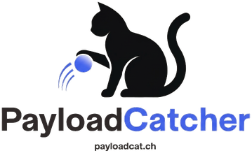

# PayloadCatcher

PayloadCatcher is a provider-agnostic webhook inspection platform that lets you quickly capture, inspect, and debug webhook payloads from any source.

## Quick Start

### Access the Live Site

Visit <https://www.payloadcat.ch> to use PayloadCatcher instantly:

1. Open <https://www.payloadcat.ch> in your browser.
2. A unique callback URL will be auto-generated and displayed.
3. Click the callback URL to copy it to your clipboard.
4. Send webhook payloads to your unique URL from any webhook provider.
5. View all captured payloads in a two-column layout: request list on the left, payload details on the right.
6. Search and filter captured requests by method, source IP, and payload content.
7. Callback URLs expire after 24 hours; refresh to get a new one.

No account signup or authentication required to get started.

## Features

- **Unique callback URLs**: Each browser session gets its own high-entropy URL paired with secure cookies.
- **Payload capture**: Accepts and stores JSON, form-encoded, plain text, and binary webhook payloads.
- **Real-time display**: View captured payloads as YAML in a clean, responsive two-column interface.
- **Mobile-friendly**: Works on desktop, tablet, and mobile devices.
- **Search and filter**: Find requests by method, source IP, and payload preview text.
- **Metadata tracking**: Captures browser info, language, timezone, referer, and geography (with consent).
- **Safe rendering**: Escapes unsafe content and handles large payloads gracefully.
- **24-hour lifecycle**: Automatic cleanup keeps the service fast and resource-efficient.

## What You Can Use It For

- Test and debug webhook integrations from third-party services.
- Inspect payload format and structure before processing in your application.
- Verify webhook signatures and custom headers.
- Prototype webhook handlers without a full local setup.
- Share webhook capture URLs with team members during integration work.

## Documentation

- **[API Reference](docs/api.md)** - Developer-facing API documentation that must stay aligned with implemented API behavior.
- **[Installation Guide](docs/install.md)** - Installation requirements, setup procedures, and post-install monitoring commands.
- **[QA Test Guide](docs/qa-test-guide.md)** - Test suites, case inventory, and regression packs for backend, API, UI, and operational QA.
- **[Requirements](docs/requirements.md)** — Functional and non-functional requirements, security model, and privacy rules.
- **[Route Contract](docs/route-contract.md)** — API specifications, request/response shapes, and database schema.
- **[UI Mock](docs/ui-mock.md)** — Visual layout guide for desktop and mobile views.
- **[Development](docs/development.md)** — How to set up and run PayloadCatcher from source locally.

## Development

To run PayloadCatcher locally:

1. Clone this repository.
2. Follow the [Development Guide](docs/development.md) to set up the backend, frontend, and database.
3. Use VS Code debugging profiles to inspect both backend and frontend behavior.

For contribution guidelines, see [Copilot Instructions](.github/copilot-instructions.md).

## License

See [LICENSE](LICENSE) for licensing details.
